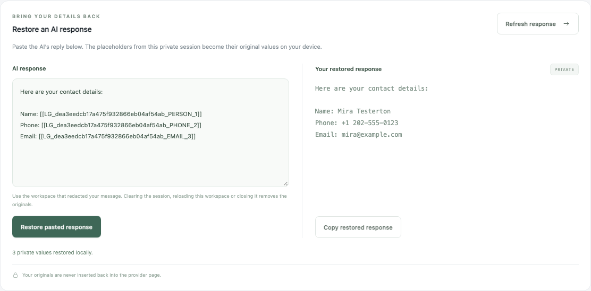

# AI Leak Guard Public

Replace sensitive details in AI prompts with local placeholders, then restore the original values in the extension when you get the answer back.

Free, open source and MIT licensed. No account, subscription or remote scanning service.



## How it works

| Step                                            | Example                                |
| ----------------------------------------------- | -------------------------------------- |
| Write your original prompt in the extension     | `Contact me at alex@example.com`       |
| Send the reviewed, sanitized prompt to the AI   | `Contact me at [[LG_…_EMAIL_1]]`       |
| Paste the AI answer back and restore it locally | `I'll contact you at alex@example.com` |

The placeholder above is schematic; actual IDs are unique to your workspace session. The AI receives the sanitized text. The original values stay in the extension's memory.

## Use it

1. Open a configured AI website and click the extension icon.
2. Write your prompt in the private workspace, then select **Check & redact**. Review the sanitized preview.
3. Select **Send sanitized message** to send that reviewed text to the website.
4. Copy the AI's answer into **AI response** and select **Restore pasted response**.
5. Select **Copy restored response** to put the result on your clipboard.

The workspace can also capture provider responses and restore known placeholders in its private response view.

**Keep the original workspace open.** Clicking the extension icon again returns to an open workspace for that provider tab. Closing or reloading the workspace, or selecting **Clear session**, loses the restoration map. Only unchanged placeholders from that workspace session can be restored. The extension never inserts restored originals into the AI website.

## Install in Chrome or Edge

These are development builds. Browser-store publication and signed releases are not available yet.

Install [Node 24 LTS](https://nodejs.org/), clone this repository, then run:

```sh
git clone https://github.com/Wagner-A-S/ai-leak-guard-public.git
cd ai-leak-guard-public
npm ci
npm run build
```

Open `chrome://extensions` or `edge://extensions`, enable **Developer mode**, select **Load unpacked**, and choose `dist/chromium`. Install only one AI Leak Guard edition per browser profile.

The build also creates Firefox and Safari packages. Firefox can load `dist/firefox/manifest.json` temporarily through `about:debugging`; Safari requires Xcode conversion and signing. See the [distribution guide](docs/PRODUCTION.md) and [CI builds](https://github.com/Wagner-A-S/ai-leak-guard-public/actions).

## What it covers

- Local checks for supported phone, email, name, address, identity, banking, payment and credential patterns: **46 rules** with phone metadata for **245 regions**, including Russia/CIS.
- TXT, CSV, Markdown and JSON imports up to 1 MB. PDF, image and audio contents are outside this edition's scanning support.
- A curated catalog of **30 AI services**, including ChatGPT, Claude and Gemini. This is configuration coverage; [provider checks](docs/PROVIDERS.md) use controlled fixtures rather than certifying every live interface.
- Personal detection settings and custom terms. Company-managed policies and arbitrary custom websites belong to the Corporate edition.

Review every sanitized preview. Pattern detection can miss sensitive facts, and websites can read original text pasted into their page before sending. Start in the extension's workspace. The **24,517 synthetic/reserved/sandbox samples** verify expected patterns; they are not real people's records or a guarantee of detection accuracy.

## Project information

[Architecture](docs/ARCHITECTURE.md) · [Contributing](CONTRIBUTING.md) · [Validation](docs/VALIDATION.md) · [Privacy](docs/distribution/PRIVACY.md) · [Security reporting](SECURITY.md) · [MIT license](LICENSE) · [Third-party notices](NOTICE.md)
