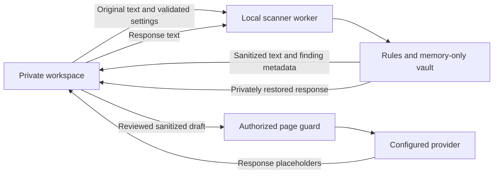

# AI Leak Guard Public architecture

The edition uses layered JavaScript modules. Pure detection and review state stay separate from browser APIs, storage, DOM adapters and packaging. One reviewed source tree generates browser-specific development builds.

## Structure

```text
src/
  core/                 Policy validation, limits, rules, redaction and private session
  platform/             Browser API, policy storage, worker RPC and guard connection
  extension/            Background broker, page guard, semantic/editor adapters and modal
  ui/                   Settings, sample inspector, private workspace and choice dialogs
assets/                 Packaged brand assets
data/                   Synthetic/reserved/sandbox regression corpus and provenance
vendor/                 Offline phone library, metadata and third-party notices
scripts/                Build, sample generation, package integrity and local preview
tests/                 Domain, adapter, race, corruption and browser checks
docs/                  Architecture, verification scope and release documentation
.github/workflows/      Standalone repository checks with pinned actions
```

There is no licensing client, entitlement verifier, vendor service, account backend or billing dependency in this edition. The original commercial project is separate. Package and extension identity, source archives and preview ports are edition-specific to allow the two editions to be installed and maintained independently.

## Boundaries

Core imports only core modules and the pinned local phone implementation. Architecture tests enforce this rule. Runtime matching never imports sample records, generators, test fixtures or UI; the corpus verifies pattern behavior and is not a lookup of real people.

The UI and platform layer communicate with the scanner worker through bounded requests. `RedactionSession` owns the private placeholder map. The UI holds the original draft and restored result it displays, but scan results omit original finding values and do not expose the map. Clear terminates the old session, creates a new nonce and invalidates previous reviews.

An AI answer pasted into the workspace uses the same worker restoration path as a captured provider response. Only exact placeholders belonging to the current session can recover their original values; unknown or altered tokens cannot be restored. The map is lost on Clear, workspace refresh or close. An explicit copy action writes the restored result to the local clipboard, without inserting originals into provider DOM or persisting the map.



Original values and restored responses are never inserted into provider DOM by the extension, persisted to extension storage, placed in URLs or sent to a scanning backend. A provider page can read originals that a user has already typed there. The private workspace is therefore the appropriate starting point for original data.

## Settings and site scope

Public reads personal local settings. Its schema permits only the curated provider hosts and no advanced accessibility-hint configuration. Installed managed policy is explicitly unsupported and blocks activation; it is not silently treated as personal settings. The Chromium managed schema remains packaged only so such installations can be recognized and rejected safely.

The background supplies only the current host adapter to the isolated guard. Chromium storage is restricted to trusted extension contexts before policy is supplied where the API is available. A supported hardening failure blocks activation. The private workspace independently verifies host, protocol version and policy readiness before enabling a send.

Both editions include only the 30 curated provider entries. Configuration is distinct from live compatibility evidence; see [provider coverage](PROVIDERS.md). Runtime scripts use semantic traversal of tags, roles, accessible names, form relationships and open shadow roots. They do not use CSS selector discovery or native browser alerts. Notices use an isolated modal; country/sample choices use searchable dialogs with keyboard and focus handling.

## Review and handoff

Draft edits, Clear, settings changes and failures invalidate the review epoch. A result is sendable only for the same epoch/settings after the sanitized preview has rendered. A handoff rechecks the target and policy across asynchronous boundaries, locks concurrent dispatch and supports cancellation by its owning workspace.

Native Enter, click/pointer and form sends are intercepted on configured pages. The modal can transfer a uniquely identified blocked draft directly into the private workspace using an expiring, one-use in-memory identifier. The background handles only that identifier/tab reference. Transfer imports unreviewed text and requires a separate check and Send.

The editor adapter writes plain or rich text through native input events, preserves paragraphs/line breaks and reads complete bounded text. Acceptance allows NFC/whitespace normalization while requiring exact placeholder identity, count and order. The guard re-resolves the current unique composer and action after framework rerenders, then permits one reviewed send. Changed content, attachments, ambiguity, disabled actions, timeout or failed readiness deny the handoff.

Activation has a bounded six-second deadline, coalesces requests for one tab and checks the latest policy and tab URL before reporting success. Late replies cannot authorize a send. Explicit support exports contain safe version/connection fields and exclude drafts, terms, placeholders, URLs and transfer identifiers.

## Browser builds and maintenance

Chromium uses a Manifest V3 service worker. Firefox and Safari use bundled background event scripts. Browser capability adapters keep platform differences out of detection. Build verification validates corpus hashes, version agreement, permissions, packaged licenses, source allowlists and archive checksums. Remote executable imports and runtime CDNs are excluded.

The standalone workflow checks source/builds and browser fixtures; publication and signing are separate maintainer actions. The source archive excludes generated binaries, credentials, operator databases and private keys. Development editor libraries are fixture-only dependencies, not the extension's runtime UI framework.

This architecture does not establish universal network DLP. Unsupported document/OCR formats, closed custom controls, provider scripts, changing integrations and direct/native traffic need additional controls and validation. See [release requirements](PRODUCTION.md) and [current evidence](VALIDATION.md).
